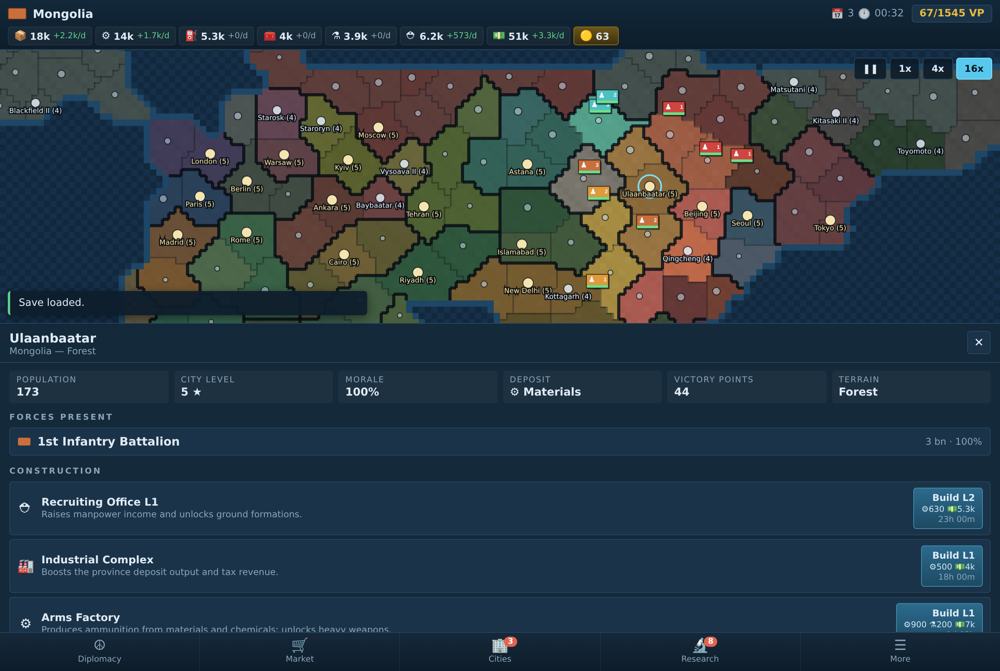

# Supremacy: World War III

A real-time global strategy game in the browser. You take one of thirty world
powers, build an economy, raise an army, and fight twenty-nine AI opponents for
control of the map. No build step, no dependencies — open `index.html` and play.



## Running it

```bash
# just open it
xdg-open index.html            # or double-click the file

# or serve it (any static server works)
npx http-server . -p 8080
```

Everything is plain ES5-compatible JavaScript loaded with `<script>` tags, so
it runs straight from `file://`.

## How the game works

**The world.** The map is generated from a coarse hand-encoded land mask of
Earth, upsampled into a 256×128 cell grid with smoothed coastlines, then carved
into ~220 land provinces and ~70 sea zones by seeded region growth. Nations grow
outward from the province nearest their real capital, taking turns one province
at a time, which leaves roughly half the map unclaimed for the opening
land-grab. The same seed always produces the same world.

**Economy.** Every province farms and pays tax; its deposit yields one of
materials, fuel or chemicals. Ammunition only exists if you build arms
factories, which burn materials and chemicals to produce it. Population, morale,
industry level and distance from your capital all feed into output. Run out of
food or cash and your units start to come apart.

**Morale** drifts toward a target set by supply distance, how many wars you are
fighting, hostile neighbours, unrest from recent conquest, and your buildings.
Low morale cuts both production and combat strength.

**Combat** resolves every game hour. Stacks sharing a province exchange fire;
damage depends on what the target force is made of (infantry, armour, air,
naval), the defender's matching defence stat, terrain, entrenchment, bunkers,
research, and how much ammunition you have left. Artillery, SAMs, destroyers
and carriers bombard a neighbouring province without entering it. Shattered
stacks withdraw rather than evaporate. Holding hostile ground unopposed runs
down an occupation timer, and then the province changes hands.

**Movement** is time-based pathfinding over the province graph — Dijkstra
weighted by travel hours, which depend on unit speed, terrain and doctrine.
Land forces crossing a sea zone are transports: fast to sink, unable to fight.
Aircraft away from an airbase or carrier bleed fuel and take attrition.

**Diplomacy** tracks a relation value and a treaty state (peace, non-aggression,
alliance, war) per pair. The AI weighs relations, relative power and how many
fronts it is already fighting on before accepting anything. Declaring war costs
you standing with everyone watching, and drags the victim's allies in.

**Research** is a 25-tech tree across six branches that unlocks units and grants
flat bonuses. **The market** is a live exchange where prices mean-revert, drift
hourly, and move against large orders.

**Winning** means reaching the victory-point threshold in the top bar (45% of
the world's total) or outlasting everyone else.

## Controls

| Action | Input |
| --- | --- |
| Pan | drag |
| Zoom | scroll / pinch |
| Select province or stack | tap |
| Pause / resume | space |
| Game speed | 1, 2, 3 |
| Cancel targeting or close | escape |

Select one of your stacks and use **Move**, **Attack**, **Bombard** or
**Launch**, then tap the target province.

## Layout

```
index.html            page shell and script order
styles/main.css       all styling
src/data/             static tables: land mask, nations, units, buildings, techs
src/engine/           seeded RNG, helpers, world generation
src/game/             simulation: state, economy, combat, orders, diplomacy, AI,
                      market, the hourly loop, save/load
src/ui/               canvas map renderer and the DOM interface
tools/                test harnesses
```

The simulation never touches the DOM, and the UI mutates the world only through
`SWW.orders`, `SWW.diplomacy` and `SWW.market` — the same entry points the AI
uses, so the player and the opponents play by identical rules.

Saves store only what the war changed. The map is regenerated from the seed on
load and the diff is replayed onto it, which keeps a save around 100 KB.

## Tests

```bash
npm test                       # both suites

node tools/simtest.js 80       # headless: run 80 game days, assert invariants
node tools/uitest.js           # headless Chromium: click through every screen
```

`simtest` generates a world, runs it forward with no player input, and checks
every hour that stacks stand on real provinces, hit points stay within bounds,
naval units stay at sea, resources stay finite and non-negative, and province
ownership records agree with the provinces themselves. It then round-trips a
save and confirms both copies evolve identically.

`uitest` loads the page in Chromium, starts a game, issues a move order, opens
every screen, runs the clock at 16×, round-trips a save, checks the desktop
layout for horizontal overflow, and fails on any console error. Screenshots land
in `tools/shots/`.

## Tuning

Most of the feel lives in a few constants:

| What | Where |
| --- | --- |
| How fast stacks melt | `DAMAGE_SCALE` in `src/game/combat.js` |
| How long conquest takes | `captureHours` in `src/game/combat.js` |
| Resource yields | `DEPOSIT_RATE`, `FARM_RATE`, `CASH_RATE` in `src/game/economy.js` |
| Starting nation sizes | `reach` in `src/data/nations.js` |
| Province count | `landProvinces` / `seaZones` opts in `src/engine/worldgen.js` |
| Victory threshold | `victoryVP` in `src/game/state.js` |
| Real seconds per game hour | `SPEEDS` in `src/game/state.js` |
