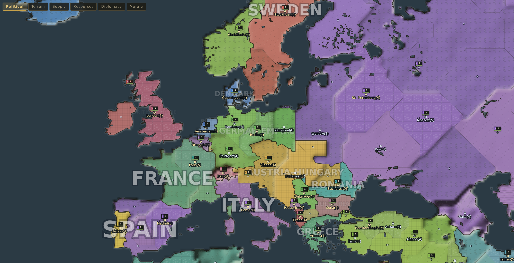

# Iron Accord

A real-time grand-strategy game of the Great War, played in the browser on a map
of the world as it stood in 1914. You take one of 54 powers — with its real
borders, its real neighbours and its real cities — mobilise an economy, raise an
army, and fight the war out. No build step, no dependencies: open `index.html`
and play.


## Running it

```bash
# just open it
xdg-open index.html            # or double-click the file

# or serve it (any static server works)
npx http-server . -p 8080
```

Everything is plain ES5-compatible JavaScript loaded with `<script>` tags, so it
runs straight from `file://`.

## The map

Borders are real. The map is compiled from [Natural
Earth](https://www.naturalearthdata.com/) 1:50m admin-0 countries and lakes,
projected with the Miller cylindrical projection and cut into **720 land
provinces and 175 sea zones** across **54 powers**. Antarctica is omitted; the
map runs from 83°N to 60°S.



- **1914 is composed from modern borders.** Natural Earth ships today's world,
  so `tools/era1914.js` maps each of 172 modern countries onto the power that
  held it — Bohemia and Croatia to Austria-Hungary, Finland and Poland to
  Russia, Korea to Japan, the Congo to Belgium — and then carves seven frontiers
  that ran through a modern country rather than around it: Posen and Silesia,
  Galicia, Alsace-Lorraine, Transylvania, Trentino and Trieste, the Hejaz, and
  Kaiser-Wilhelmsland. Each carve is a longitude/latitude box scoped to the
  country it takes from, so it cannot bleed into a neighbour, and the build
  fails if one of them moves no ground.
- **Provinces** are generated inside each power, sized by a blend of area and
  where people actually live. Area alone would hand Denmark more provinces than
  the German Empire, because Greenland is enormous under this projection and
  Silesia is not. A province never crosses a national border.
- **Province names are real cities** — 640 of the 720 — under the names they
  went by at the time: Constantinople, Petrograd, Christiania, Lemberg.
- **Population is real too**, taken from the city data and compressed onto a
  playable scale, so the Ruhr and Bengal are worth fighting over and Siberia is
  worth crossing.
- **Colours are graph-coloured** over the country adjacency graph, maximising
  hue distance, so no two powers that share a border look alike.

`src/data/worldmap.js` (208 KB) is committed, so nothing is downloaded at play
time. To rebuild it — after changing the province count, the projection, the
1914 composition, or the source data — run `npm run build:map`, which fetches
and caches the Natural Earth files into `tools/geodata/`.

## How the game works

**The alliances of 1914 are already in place.** Every power belongs to the
Central Powers, the Entente, or the neutrals; the two blocs start at war with
each other and allied within themselves, and the neutrals start out of it with
their own opinions to form.

**The war opens on 28 July 1914** and runs on the real calendar, which is what
makes the seasons mean anything. Weather is settled once a day per weather cell
— about twelve degrees by ten, with the grid drifting eastward so fronts move —
from a table for that cell's climate and season. It costs you in three places:
movement, the fire a stack puts out, and attrition. An offensive launched in
October moves at half the pace of one launched in June, a mountain range has a
polar winter, and the southern hemisphere runs six months out of step.

**Economy.** Every province farms and pays tax, and its deposit yields grain,
timber, coal, iron or oil following real geography. Shells are not a deposit:
they exist only if you build the works to make them, and those burn iron and
coal to do it. Population, morale, industry and distance from your capital all
feed into output. Manpower is finite and conscription is a technology. Run short
of grain or money and your army comes apart in the field.

**Terrain and climate** follow the real world: the Sahara and the Gobi are
desert, the Amazon and the Congo are jungle, Siberia and northern Canada are
taiga and tundra, the Himalaya and the Andes are mountains. Mountains and jungle
slow attackers and shelter defenders.

**Supply** is a network, not a distance. It flows out from your capital and from
every depot, harbour and railway yard, province by province across ground you
hold or are allied to, each source with a reach that crossing a province spends
— less where a railway carries it. It does not pass through a province an enemy
army is standing in, so a raid behind the line cuts the front off without having
to take the ground first. Somewhere nothing reaches is out of supply: morale
falls, and a land stack there loses men every hour and fights at 62%. An army is
fed by the province it stands in or one next to it, so an invasion reaches one
province past its own border and has to take ground to push on.

**Morale** drifts toward a target set by supply, how many wars you are fighting,
hostile neighbours, unrest from recent conquest, and your buildings. Low morale
cuts both production and combat strength.

**Officers** command stacks, one to a stack, and armies stop being
interchangeable. Traits are two-sided wherever they are strong: an officer who
presses every attack home is not the one you want holding a line, and a
methodical one will not move until everything is in place. Rank is earned in
battles that finish and opens room for a second and third speciality. An officer
lost with his stack is killed or captured half the time and gone for good.

**Combat** resolves every game hour. Stacks sharing a province exchange fire;
damage depends on what the target force is made of (infantry, armour, air,
naval), the defender's matching defence stat, terrain, entrenchment,
fortifications, research, and how many shells you have left. Artillery bombards
a neighbouring province without entering it, and siege guns reach further still.
Shattered stacks withdraw rather than evaporate. Holding hostile ground
unopposed runs down an occupation timer, and then the province changes hands.

**Movement** is time-based pathfinding over the province graph — Dijkstra
weighted by travel hours, which depend on unit speed, terrain and doctrine. You
cannot march through a country you are at peace with: get a war, an alliance, or
go around. Land forces crossing a sea zone are transports, fast to sink and
unable to fight. Aircraft away from an aerodrome run out of fuel.

**Diplomacy** tracks a relation value and a treaty state (peace, non-aggression,
alliance, war) per pair, but only between powers that share a border or already
have history. Pacts have a term — 90 days for a non-aggression pact, 180 for an
alliance — and lapse when it runs out. Letting one lapse is free; walking out
early, or turning on the power you signed with, is not.

**Reputation** runs 0..100 from a base of 75. Attacking an ally costs 34, a pact
partner 22, and falling on a power that had given you no cause 12. It recovers
about a point a fortnight, so working off one torn-up alliance takes a year of
good conduct, and powers weigh it when deciding whether to sign — heavily for an
alliance, less for a pact, barely at all for a ceasefire, where the fighting is
the point and the paper is secondary.

**Intelligence** puts agents into another power's territory to report on it,
wreck a works, take a technology, or make a province ungovernable — or sweeps
your own ground against theirs. Operations take days, and agents are a hard
limit that grows with your administration rather than your treasury. Being
caught costs relations with the victim and standing with everyone else.

**Research** is a 28-technology tree across eight branches — infantry, artillery,
armour, air, naval, industry, logistics and the home front — that unlocks units
and grants flat bonuses. It follows the war's own arc: everyone starts able to
raise infantry and dig in, and the things that break a stalemate (infiltration,
siege guns, landships, aviation) are deliberately expensive and late.
**The market** is a live exchange where prices mean-revert, drift hourly, and
move against large orders.

**Winning** can be done six ways, deliberately pulling in different directions:
hold a third of the world's victory points, hold six other powers' capitals at
once, lead an alliance holding half the world, turn out a third of the world's
war material for thirty straight days, be the last power standing, or simply be
ahead when the guns fall silent on 11 November 1918. Each reports progress as
well as whether it is met — a victory condition nobody can see the state of is
one nobody plays toward — and you do not have to win the one everybody else is
playing for.

**Battles** are recorded. An engagement runs from the hour hostile stacks first
trade fire until one of them is gone, and the report says what each side
committed and what came back out, so a skirmish reads differently from a
catastrophe.

**A campaign is set up before it starts**: length of the war, victory threshold,
the other powers' appetite for war, opening stockpiles, and whether there is fog
of war at all. Each is a small set of named choices rather than a slider,
because "a fortnight" and "the whole war" are decisions a player can make and
0.7 is not.

## Controls

| Action | Input |
| --- | --- |
| Pan | drag |
| Zoom | scroll / pinch |
| Select province or stack | tap |
| Pause / resume | space |
| Game speed | 1, 2, 3 |
| Cancel targeting or close | escape |

Select one of your stacks and use **Move**, **Attack** or **Bombard**, then tap
the target province.

A first campaign opens a short lesson that watches what you do: every step is a
question asked of the real game — has a province been selected, is something in
the build queue, is a technology being researched — so there is no scripted path
and anything you have already done is ticked off as the lesson reaches it.

Sound is ten synthesised cues; there is not a single audio asset in the
repository. Volume lives under **More → Game**.

## Layout

```
index.html            page shell and script order
styles/main.css       all styling
src/data/worldmap.js  the compiled map (generated — do not hand-edit)
src/data/             unit, building and research tables
src/engine/           seeded RNG, helpers, map decoder, per-game world setup
src/game/             simulation: state, economy, combat, orders, diplomacy, AI,
                      market, the hourly loop, save/load
src/ui/               canvas map renderer and the DOM interface
tools/era1914.js      who held what in 1914, and what it was called then
tools/buildmap.js     the map compiler
tools/                test harnesses and the screenshot tool
```

The simulation never touches the DOM, and the UI mutates the world only through
`IA.orders`, `IA.diplomacy`, `IA.espionage`, `IA.commanders` and `IA.market` —
the same entry points the AI uses, so the player and the opponents play by
identical rules. Sound is the one thing that crosses the line, and it crosses it
the other way: the simulation leaves a name on a queue and the interface drains
it, so the simulation stays DOM-free and stays silent when nobody is watching. Keeping the simulation
DOM-free is also what would let it move to a server later without a rewrite.

Saves store only what the war changed. Geography comes from the compiled map and
terrain is a pure function of the seed, so loading rebuilds the world and
replays the diff onto it.

### What you see

The ground is shaded. There is no elevation model in the map data, so the
terrain each province already carries is treated as a description of it — a
base height and a roughness — painted into a field, given fractal noise in
proportion to how broken it is, and lit from the north-west. Shading is scaled
by roughness rather than applied evenly: lit evenly, farmland picks up as much
relief as the Alps and the whole map goes pale and mottled.

Units are drawn, not typed. Thirteen silhouettes over nineteen units, built
from canvas path commands — crossed rifles for foot, a horse's head for
cavalry, a barrel and wheel for a field gun, a tracked hull for a landship.
There is no image, font or emoji anywhere in the set. A stack marker carries
the leading unit's silhouette, the battalion count, a strength bar, and two
states you would otherwise have to select the stack to discover: out of supply,
and an officer in command.

**Map modes** put the simulation on the map. Six of them — political, terrain,
supply, resources, diplomacy, morale — over the same geometry. Supply is the
one that earns it: a few days into a campaign it shows which of your provinces
are fed and which are cut off, at a glance, which previously required opening
each one.

Fighting is a shellburst that pulses on the frame clock and fades as the hour
since the last exchange runs out, so a live front flickers and a quiet one
stops. Ground changing hands — the most consequential thing that happens, and
the easiest to miss — washes the province in the new owner's colour for six
hours and fades.

The technology tree is laid out by dependency depth with connectors drawn from
the measured positions of the nodes, so it shows what needs what rather than
saying so in prose.

### Rendering

Province outlines are real vector paths, so borders stay crisp at any zoom.
Drawing seven hundred of them every frame is too slow with the whole world on
screen, so the renderer has two modes: zoomed out it blits a cached raster of
the political map, repainted only around provinces that actually change hands;
zoomed in it draws vectors with bounding-box culling. Both use the same colours
and line weights, so crossing the threshold is not noticeable.

Provinces are not flat colour. Each terrain type has a tiling pattern — ridges
for mountains, canopy for forest, dunes for desert, a street grid for cities —
laid over the national colour, with the pattern transform keeping the texture a
constant size on screen at any zoom. Coastlines get a band of pale shelf water,
borders are light on dark (thin between provinces, heavy between nations), and
country names are set across the map in atlas style: biggest first, any label
that would collide with one already placed simply dropped, and none allowed to
run wider than the land it names. A country is named once per connected block of
territory rather than once overall — an empire's area-weighted centre is nowhere
near its homeland, which is how you end up with FRANCE written across the Sahara
— and the block holding the capital is always named however small it is.

**Smoothness.** Stroking the borders and the coastal shelf is by far the most
expensive thing on screen: measured at a phone viewport it is about seventeen
milliseconds a frame at a continental zoom, which is the entire 60 fps budget.
Almost none of it changes between frames, so the ground is kept in a layer the
size of the viewport and each frame only reconciles that layer with where the
camera now is — nothing to do when the map is still, and when it is being
dragged, scroll the layer by whole device pixels and repaint only the strip that
has come into view, a few percent of the screen. A new zoom, a resize or a
province changing hands repaints the lot.

Three other things keep it fluid:

- the canvas is capped at 2× pixel density, because phones report 3× and above
  and the extra pixels cost triple the fill rate for a difference nobody can see
  on a map in motion;
- terrain texture is a second layer, so it fades in over a still map by changing
  an alpha rather than by redrawing anything;
- terrain detail stands down entirely while the view is moving and fades back in
  90 ms after it settles.

Dragging also has momentum: a flick keeps coasting and decays to a stop instead
of stopping dead under your finger.

## Tests

```bash
npm test                       # all three suites

node tools/simtest.js 80       # headless: run 80 game days, assert invariants
node tools/uitest.js           # headless Chromium: click through every screen
node tools/perftest.js         # headless Chromium: frame times on a phone
node tools/hero.js [europe]    # regenerate the README map images
```

`simtest` builds a world, runs it forward with no player input, and checks every
hour that stacks stand on real provinces, hit points stay within bounds, naval
units stay at sea, resources stay finite and non-negative, and province ownership
records agree with the provinces themselves. It also asserts the map is really
the 1914 world, then round-trips a save and confirms both copies evolve
identically.

Beyond that it tests the mechanics rather than the plumbing, which is a
different thing:

- it plants a hostile stack on every province around the player's capital and
  requires the country behind it to go dark, then clears them and requires
  supply to come back;
- it winds the clock a year to check all four seasons arrive, that January is
  winter in Petrograd and summer below 30°S, and that winter actually puts snow
  on the ground;
- it drives each of the six victory conditions to its trigger on a throwaway
  save/load copy of the world and checks the right one fires;
- it runs each intelligence operation with the roll forced, rather than hoping
  the AI happens to run one of each;
- it checks the arithmetic on every filed battle report — nobody losing more
  than they committed, the casualty total being the sum of the sides, the
  recorded winner being a side that actually held the ground;
- and it checks the officer links in both directions, because stacks are
  destroyed constantly and a commander pointing at one that no longer exists is
  exactly the bug that will not announce itself.

`uitest` loads the page in Chromium, starts a game, issues a move order, confirms
an army is refused entry to a neighbour it is at peace with, declares war through
the confirmation dialog and checks the treaty really changed, opens every screen,
runs the clock at 16×, round-trips a save, checks the desktop layout for
horizontal overflow, and fails on any console error. It also:

- sets the campaign up through the actual menu controls and then checks the
  resulting world against them — that victory really is half the map, that the
  armistice is inside a year, that no province is hidden with fog off;
- drags the map 120 times and compares the scrolled layer against a repaint of
  the same view from scratch, which is the only way a seam or a band of stale
  ground in the scrolling renderer would ever be noticed;
- exercises the whole audio chain, since headless Chromium has real WebAudio and
  no speakers: all ten sounds build their nodes, volume reaches the master gain,
  and a cue left by the simulation is drained by the interface;
- and plays the tutorial through ordinary game code, requiring it to walk its
  six steps on its own. Nothing in that test tells the tutorial it has advanced.

Screenshots land in `tools/shots/`.

`perftest` runs the game at a 390x844 phone viewport at 3x pixel density with the
clock at 16x and samples real frame deltas at four zoom levels including a
continuous pan. It fails on the **median** frame time rather than an average or a
drop count: across repeated runs on a shared machine the median is immovable
while the tail wanders with the host scheduler, and the regression this file was
written to catch sat at 33 ms — a doubling no amount of averaging could hide.

`buildmap` checks itself too. It verifies that 23 real cities land inside a
province held by the right power in 1914 — Warsaw Russian, Poznan German, Lviv
Austrian, Leopoldville Belgian — that a frontier carve which moves no ground is
an error rather than a silent no-op, that every traced province outline is a
closed chain, that the coordinate encoder round-trips exactly, and that no
province spans more than 150 map units. That last one exists because islands the
region growth cannot walk to used to be handed to whichever region lay nearest
with no limit on distance, which built provinces reaching across oceans and put
Copenhagen off the coast of Iceland — and every other check passed, because the
province did belong to Denmark.

## Tuning

Most of the feel lives in a few constants:

| What | Where |
| --- | --- |
| How fast stacks melt | `DAMAGE_SCALE` in `src/game/combat.js` |
| How long conquest takes | `captureHours` in `src/game/combat.js` |
| Resource yields | `DEPOSIT_RATE`, `FARM_RATE`, `CASH_RATE` in `src/game/economy.js` |
| Starting stockpiles | `START_RESOURCES` in `src/game/state.js` |
| Population compression | `gamePop` in `src/engine/worldgen.js` |
| Climate and relief | the lon/lat boxes in `src/engine/worldgen.js` |
| Who held what in 1914 | `HELD_BY` and `SPLITS` in `tools/era1914.js` (then rebuild) |
| Province count | `TARGET_PROVINCES` in `tools/buildmap.js` (then rebuild) |
| Victory threshold | `victoryVP` in `src/game/state.js` |
| Real seconds per game hour | `SPEEDS` in `src/game/state.js` |
| Supply reach and attrition | `CAPITAL_REACH`, `ARMY_ATTRITION` in `src/game/economy.js` |
| What each kind of weather does | `WEATHER` in `src/game/weather.js` |
| What officers are good at | `TRAITS` in `src/data/commanders.js` |
| The cost of a betrayal | `BETRAYAL` in `src/game/diplomacy.js` |
| How the war can be won | `CONDITIONS` in `src/game/victory.js` |
| Campaign defaults | `DEFAULT_SETTINGS` in `src/game/state.js` |

## Data and attribution

Map data © [Natural Earth](https://www.naturalearthdata.com/), public domain.
Modern borders, names and status follow that dataset's conventions; the 1914
composition on top of them is this project's own, and is a playable
approximation rather than a scholarly one. Frontiers that were contested at the
time are drawn one way so the game has an answer, not because the question was
settled.

Iron Accord is an original game. The name, artwork, icons, interface, unit and
technology tables, map and code are its own, and it is not affiliated with or
derived from the assets of any commercial title.
