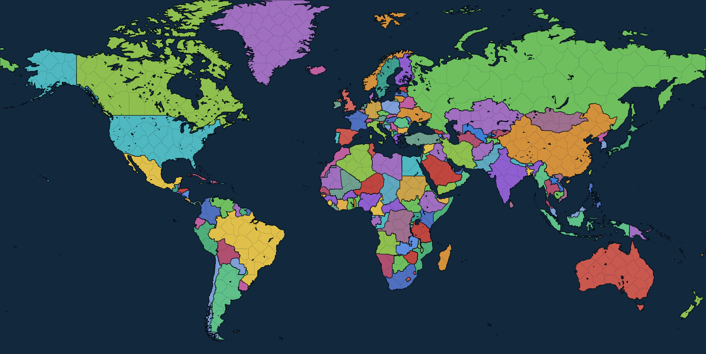

# Supremacy: World War III

A real-time global strategy game in the browser, played on a map of the real
world. You take one of 189 countries — with its actual borders, actual
neighbours and actual cities — build an economy, raise an army, and fight for
control of the map. No build step, no dependencies: open `index.html` and play.



## Running it

```bash
# just open it
xdg-open index.html            # or double-click the file

# or serve it (any static server works)
npx http-server . -p 8080
```

Everything is plain ES5-compatible JavaScript loaded with `<script>` tags, so
it runs straight from `file://`.

## The map

Borders are real. The map is compiled from [Natural
Earth](https://www.naturalearthdata.com/) 1:50m admin-0 countries and lakes,
projected with the Miller cylindrical projection and cut into **642 land
provinces and 171 sea zones** across **189 playable countries**. Antarctica is
omitted; the map runs from 83°N to 60°S.

- **National borders are the source data**, rasterised at ~5 km and traced back
  into vector outlines, so France is France-shaped and the Great Lakes, the
  Caspian and Lake Victoria are all there.
- **Provinces** are generated inside each country, sized so that a country gets
  roughly one province per equal area of land — Russia has 53, Mongolia 8,
  Kuwait 1. A province never crosses a national border.
- **Province names are real cities**: 552 of the 642 are named after the largest
  Natural Earth populated place inside them, and the rest after the
  administrative region of the nearest one. Capitals are the real capitals.
- **Population is real too**, taken from the city data and compressed onto a
  playable scale, so Bengal and the Ruhr are worth fighting over and Siberia is
  worth crossing.
- **Territories fold into their sovereign** the way a political world map shows
  them (Greenland with Denmark, Guam with the United States). Areas Natural
  Earth marks as disputed or indeterminate belong to nobody and can be claimed.
- **Colours are graph-coloured** over the country adjacency graph, maximising
  hue distance, so no two countries that share a border look alike.

`src/data/worldmap.js` (221 KB) is committed, so nothing is downloaded at play
time. To rebuild it — after changing the province count, the projection, or the
source data — run `npm run build:map`, which fetches and caches the Natural
Earth files into `tools/geodata/`.

## How the game works

**Economy.** Every province farms and pays tax; its deposit yields one of
materials, fuel or chemicals, following real geography — the Gulf, West Siberia
and Texas produce oil. Ammunition only exists if you build arms factories, which
burn materials and chemicals to make it. Population, morale, industry level and
distance from your capital all feed into output. Run out of food or cash and
your units start to come apart.

**Terrain and climate** follow the real world: the Sahara and the Gobi are
desert, the Amazon and the Congo are jungle, Siberia and northern Canada are
taiga and tundra, the Himalaya and the Andes are mountains. Mountains and jungle
slow attackers and shelter defenders.

**Morale** drifts toward a target set by supply distance, how many wars you are
fighting, hostile neighbours, unrest from recent conquest, and your buildings.
Low morale cuts both production and combat strength.

**Combat** resolves every game hour. Stacks sharing a province exchange fire;
damage depends on what the target force is made of (infantry, armour, air,
naval), the defender's matching defence stat, terrain, entrenchment, bunkers,
research, and how much ammunition you have left. Artillery, SAMs, destroyers and
carriers bombard a neighbouring province without entering it. Shattered stacks
withdraw rather than evaporate. Holding hostile ground unopposed runs down an
occupation timer, and then the province changes hands.

**Movement** is time-based pathfinding over the province graph — Dijkstra
weighted by travel hours, which depend on unit speed, terrain and doctrine. You
cannot march through a country you are at peace with: get a war, an alliance, or
go around. Land forces crossing a sea zone are transports, fast to sink and
unable to fight. Aircraft away from an airbase or carrier bleed fuel.

**Diplomacy** tracks a relation value and a treaty state (peace, non-aggression,
alliance, war) per pair, but only between countries that actually share a
border or already have history — Chile has no opinion about Laos until they
meet. The AI weighs relations, relative power and how many fronts it is already
fighting on. Declaring war costs you standing with the neighbours and drags the
victim's allies in. Nobody declares war in the first three days.

**Research** is a 25-tech tree across six branches that unlocks units and grants
flat bonuses. **The market** is a live exchange where prices mean-revert, drift
hourly, and move against large orders.

**Winning** means holding a third of the world's victory points, or outlasting
everyone else. It is a long war.

## Controls

| Action | Input |
| --- | --- |
| Pan | drag |
| Zoom | scroll / pinch |
| Select province or stack | tap |
| Pause / resume | space |
| Game speed | 1, 2, 3 |
| Cancel targeting or close | escape |

Select one of your stacks and use **Move**, **Attack**, **Bombard** or
**Launch**, then tap the target province.

## Layout

```
index.html            page shell and script order
styles/main.css       all styling
src/data/worldmap.js  the compiled map (generated — do not hand-edit)
src/data/             unit, building and research tables
src/engine/           seeded RNG, helpers, map decoder, per-game world setup
src/game/             simulation: state, economy, combat, orders, diplomacy, AI,
                      market, the hourly loop, save/load
src/ui/               canvas map renderer and the DOM interface
tools/buildmap.js     the map compiler
tools/                test harnesses
```

The simulation never touches the DOM, and the UI mutates the world only through
`SWW.orders`, `SWW.diplomacy` and `SWW.market` — the same entry points the AI
uses, so the player and the opponents play by identical rules.

Saves store only what the war changed. Geography comes from the compiled map and
terrain is a pure function of the seed, so loading rebuilds the world and
replays the diff onto it.

### Rendering

Province outlines are real vector paths, so borders stay crisp at any zoom.
Drawing 800 of them every frame is too slow with the whole world on screen, so
the renderer has two modes: zoomed out it blits a cached raster of the political
map, repainted only around provinces that actually change hands; zoomed in it
draws vectors with bounding-box culling. Both use the same colours and line
weights, so crossing the threshold is not noticeable.

Provinces are not flat colour. Each terrain type has a tiling pattern — ridges
for mountains, canopy for forest, dunes for desert, a street grid for cities —
laid over the national colour, with the pattern transform keeping the texture a
constant size on screen at any zoom. Coastlines get a band of pale shelf water,
borders are light on dark (thin between provinces, heavy between nations), and
country names are set across the map in atlas style: biggest first, with any
label that would collide with one already placed simply dropped. City dots and
stack markers thin out as the view widens so the world view stays legible.

## Tests

```bash
npm test                       # both suites

node tools/simtest.js 80       # headless: run 80 game days, assert invariants
node tools/uitest.js           # headless Chromium: click through every screen
```

`simtest` builds a world, runs it forward with no player input, and checks every
hour that stacks stand on real provinces, hit points stay within bounds, naval
units stay at sea, resources stay finite and non-negative, and province
ownership records agree with the provinces themselves. It also asserts the map
is really the real world — that France is called France and holds Paris, that
Japan holds Tokyo — then round-trips a save and confirms both copies evolve
identically.

`uitest` loads the page in Chromium, starts a game as Mongolia, issues a move
order, confirms an army is refused entry to a neighbour it is at peace with,
declares war through the confirmation dialog and checks the treaty really
changed, opens every screen, runs the clock at 16×, round-trips a save, checks
the desktop layout for horizontal overflow, and fails on any console error.
Screenshots land in `tools/shots/`.

`buildmap` checks itself too: it verifies fifteen real capitals land inside a
province owned by the right country, that every traced province outline is a
closed chain, and that the coordinate encoder round-trips exactly.

## Tuning

Most of the feel lives in a few constants:

| What | Where |
| --- | --- |
| How fast stacks melt | `DAMAGE_SCALE` in `src/game/combat.js` |
| How long conquest takes | `captureHours` in `src/game/combat.js` |
| Resource yields | `DEPOSIT_RATE`, `FARM_RATE`, `CASH_RATE` in `src/game/economy.js` |
| Population compression | `gamePop` in `src/engine/worldgen.js` |
| Climate and relief | the lon/lat boxes in `src/engine/worldgen.js` |
| Province count | `TARGET_PROVINCES` in `tools/buildmap.js` (then rebuild) |
| Victory threshold | `victoryVP` in `src/game/state.js` |
| Real seconds per game hour | `SPEEDS` in `src/game/state.js` |

## Data and attribution

Map data © [Natural Earth](https://www.naturalearthdata.com/), public domain.
Country borders, names and status follow that dataset's conventions; disputed
and indeterminate areas are left unclaimed rather than assigned to a side.
